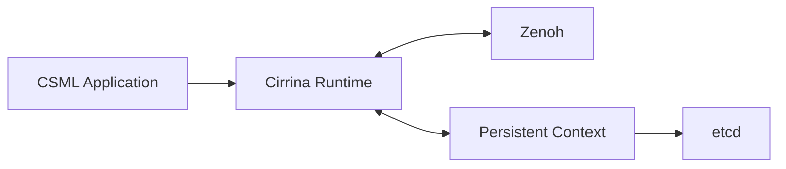
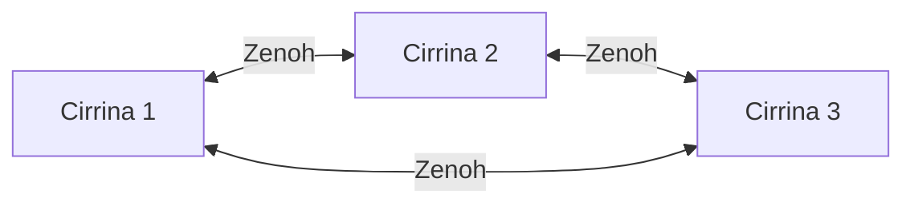
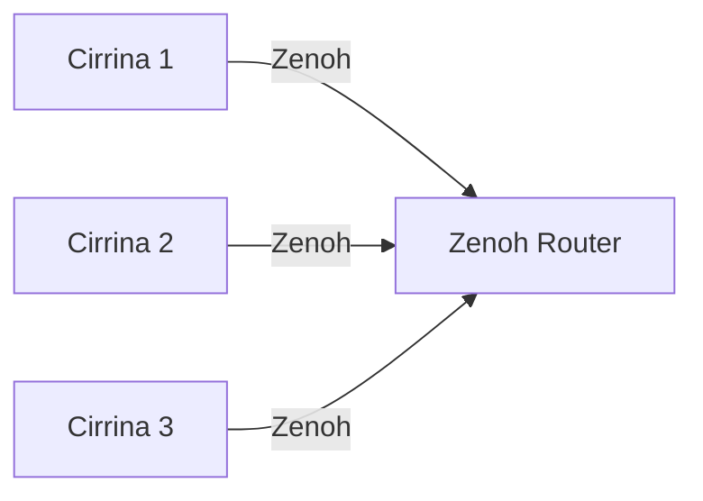

# Cirrina Runtime

Cirrina is the runtime environment for executing **Collaborative State Machines** as distributed applications. It provides the infrastructure required to instantiate state machines, exchange events between runtime instances, and maintain persistent application context.

A Cirrina deployment consists of one or more runtime instances. Each instance executes state machine instances defined by a CSML application and communicates with other instances through [Zenoh](https://zenoh.io/). Persistent context is managed through a context provider, with [etcd](https://etcd.io/) currently supported as the default provider.

The runtime separates the **application model** from the **execution infrastructure**. Developers describe the behavior and coordination of distributed applications using Collaborative State Machines, while Cirrina manages execution, communication, persistence, and observability.



## Quickstart

Pull the latest Cirrina image:

```bash
docker pull collaborativestatemachines/cirrina:latest
```
For local development, you can also use Docker Compose to start Cirrina together with its dependencies. This is convenient when repeatedly starting and stopping the complete development environment.
Alternatively, Cirrina and its dependencies can be started individually.

#### Create the network

Create a Docker network shared by the runtime, etcd, and Zenoh:

```bash
docker network create cirrina
```

#### Start etcd

Start an etcd instance:

```bash
docker run -d \
  --network cirrina \
  --name etcd-local \
  gcr.io/etcd-development/etcd:v3.5.0 \
  /usr/local/bin/etcd \
  --name s1 \
  --listen-client-urls http://0.0.0.0:2379 \
  --advertise-client-urls http://etcd-local:2379 \
  --listen-peer-urls http://0.0.0.0:2380 \
  --initial-advertise-peer-urls http://etcd-local:2380 \
  --initial-cluster s1=http://etcd-local:2380
```

#### Run Cirrina

The following example executes the `pingPong.pkl` application:

```bash
docker run \
  --network cirrina \
  -e RUN=ping,pong \
  -e MAIN_URI=https://raw.githubusercontent.com/CollaborativeStateMachines/Cirrina/refs/heads/develop/examples/concurrency/pingPong.pkl \
  -e ETCD_CONTEXT_URL=http://etcd-local:2379 \
  collaborativestatemachines/cirrina:latest
```

The `RUN` variable specifies the state machine instances to execute, while `MAIN_URI` identifies the CSML application containing their definitions. We recommend developing and maintaining your CSML application in a GitHub repository, which provides version control and makes it easy to collaborate on and distribute your use case. Once the application is available, `MAIN_URI` can point directly to the raw GitHub URL of the CSML file, allowing the runtime to retrieve and execute the application without requiring it to be packaged locally.

## Configuration

Cirrina is configured through environment variables:

| Variable                         | Default                | Description                                                |
| -------------------------------- | ---------------------- | ---------------------------------------------------------- |
| `ETCD_CONTEXT_URL`               | `null`                 | Address of the etcd context provider                       |
| `ZENOH_EVENT_HANDLER_CONFIG_URI` | `null`                 | Zenoh endpoint used for distributed communication          |
| `MAIN_URI`                       | `file:///app/main.pkl` | URI of the main CSML application                           |
| `CONTEXT_PROVIDER`               | `ETCD`                 | Context provider used for persistent state                 |
| `METRICS_DIRECTORY`              | `metrics`              | Directory where runtime metrics are stored                 |
| `METRICS_PERIOD`                 | `1`                    | Metrics collection period                                  |
| `RUN`                            | empty                  | Comma-separated list of state machine instances to execute |

For example:

```bash
-e RUN=ping,pong
-e MAIN_URI=https://raw.githubusercontent.com/CollaborativeStateMachines/Cirrina/refs/heads/develop/examples/concurrency/pingPong.pkl
-e ETCD_CONTEXT_URL=http://etcd-local:2379
```

## Distributed communication with Zenoh

Cirrina uses [Zenoh](https://zenoh.io/) to exchange events between runtime instances. The application does not need to manage connections or transport mechanisms directly; communication is handled by the runtime.

### Peer-to-peer deployment

When Cirrina instances are deployed on the same network, they can discover each other automatically through Zenoh's peer-to-peer communication. Each Cirrina instance starts a Zenoh session in peer mode, allowing it to participate directly in the Zenoh network. When peer discovery is enabled, Zenoh uses the available discovery mechanisms to identify other peers on the network and establish communication paths between them.
As a result, no central broker or manually configured connection between Cirrina instances is required. Once the peers have discovered each other, Cirrina can exchange events directly between runtime instances through the Zenoh network.
This configuration is particularly useful for local deployments and environments where participating nodes share a network.





### Zenoh router deployment

Automatic peer discovery may not be available when nodes are deployed across different networks or infrastructure domains. In these environments, Cirrina instances can connect through a Zenoh router.

The Docker Compose configuration includes a Zenoh router by default.



For a manual deployment, start a Zenoh router:

```bash
docker run \
  --network cirrina \
  -p 7447:7447 \
  eclipse/zenoh:latest
```

Then configure Cirrina to connect to the router:

```bash
docker run \
  --network cirrina \
  -e RUN=ping,pong \
  -e MAIN_URI=https://raw.githubusercontent.com/CollaborativeStateMachines/Cirrina/refs/heads/develop/examples/concurrency/pingPong.pkl \
  -e ETCD_CONTEXT_URL=http://etcd-local:2379 \
  -e ZENOH_EVENT_HANDLER_CONFIG_URI=tcp://zenoh:7447 \
  collaborativestatemachines/cirrina:latest
```

For nodes deployed on different networks, replace `zenoh` with the hostname or IP address through which the Zenoh router is reachable.

## Persistent context

Collaborative State Machines distinguish between transient execution data and persistent application context.

Transient data belongs to the execution of a particular state machine instance and is maintained by the runtime. Persistent data is associated with the root collaborative state machine and is intended to remain available independently of an individual state machine instance.
Cirrina externalizes persistent context through a context provider. The default provider is etcd.

The context provider is deliberately separated from the execution layer. This allows runtime instances to access persistent application state while communicating independently through Zenoh.

## Example application

The `pingPong.pkl` example demonstrates communication between two state machine instances. One machine emits an event to another machine, which reacts to the event and subsequently emits an event back.

Run the example with:

```bash
docker run \
  --network cirrina \
  -e RUN=ping,pong \
  -e MAIN_URI=https://raw.githubusercontent.com/CollaborativeStateMachines/Cirrina/refs/heads/develop/examples/concurrency/pingPong.pkl \
  -e ETCD_CONTEXT_URL=http://etcd-local:2379 \
  collaborativestatemachines/cirrina:latest
```

The example demonstrates the basic execution model of Cirrina: state machine instances execute within the runtime, exchange events through Zenoh, and access persistent application context through the configured context provider.

## Development

Cirrina provides the runtime layer for applications expressed using the Collaborative State Machines model. Development can therefore be performed at two levels:

1. **Application level** — define state machines, states, transitions, events, and persistent data using CSML.
2. **Runtime level** — extend the mechanisms responsible for execution, communication, context management, and observability.

This separation allows the programming model to remain independent of the infrastructure used to execute it.
